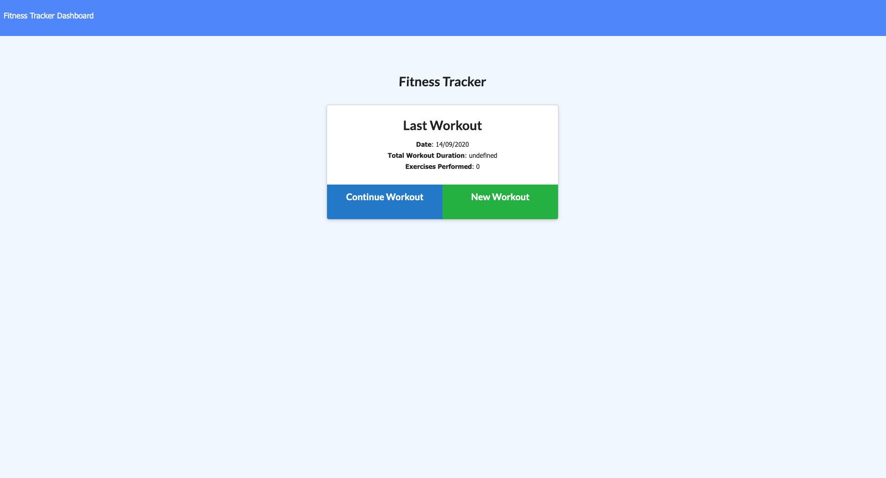
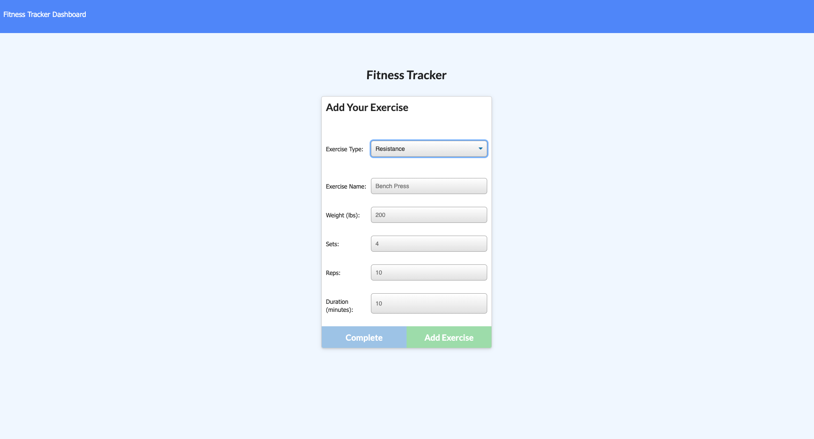
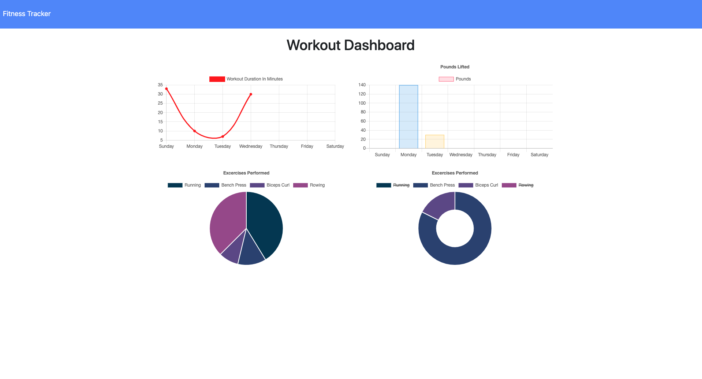

# Workout Tracker

  ## Description
  An APP that keeps track of your daily workouts, done with Mongo databasem a Mongoose schema and handles routes with Express.

  
  
  ## Table of contents
  
  * [Installation](#installation)
  * [Usage](#usage)
  * [License](#license)
  * [Contributing](#contributing)
  * [Questions](#questions)
  

  ## Installation
  
  This app is hosted on heroku. You can access the app by clicking [here](https://guedesantonio-workout-tracker.herokuapp.com/).
  
  ## Usage

  After loading the initial page, the user should be given the option to create a new workout or, if there is previous saved workouts, continue with their last workout.

  At the New Workout page the user should be able to:

  - Add exercises to a previous workout plan.

  - Add new exercises to a new workout plan.

  

  At the Fitness Tracker Dashboard

  - View the combined weight of multiple exercises.

  - View the combined time of workouts per week day.

  - View graphic information about every type of exercise and change view.

  

  ## License
  This project is licensed under the MIT.

  ## Contributing
  See [Questions](#Questions) section.

  ## Questions
  If you have any questions about the repo, open an issue or contact me directly at gguedesantonio@gmail.com. 
  You can find more about my work at [Github profile](https://github.com/guedesantonio). 
